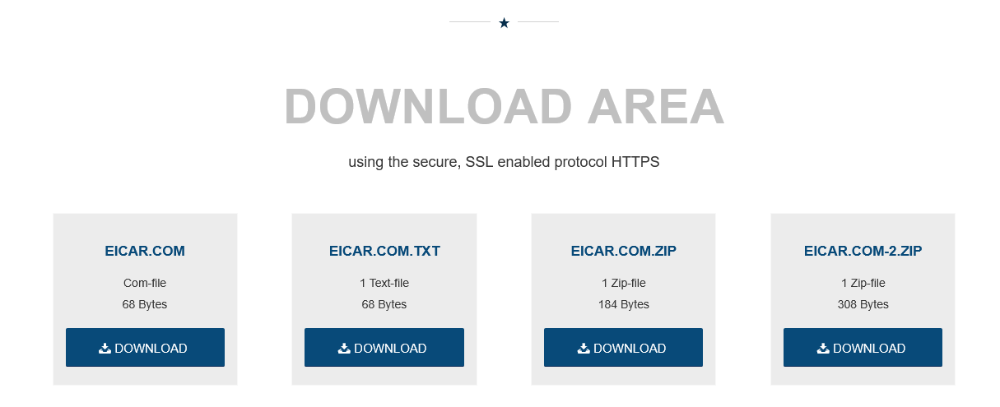
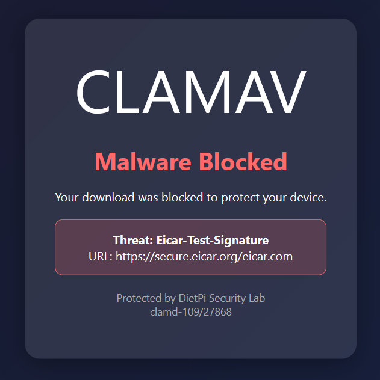
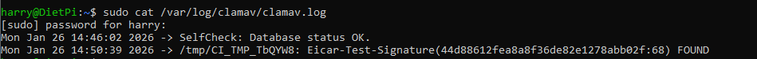
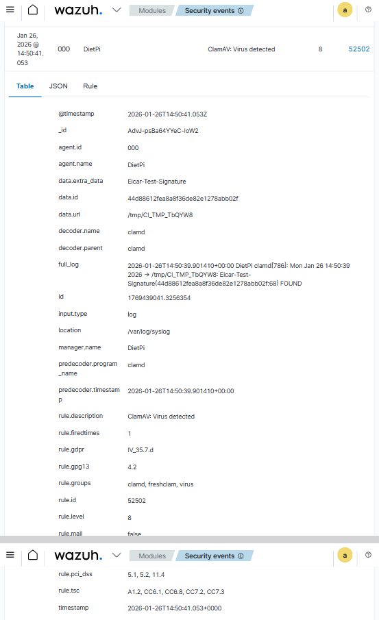
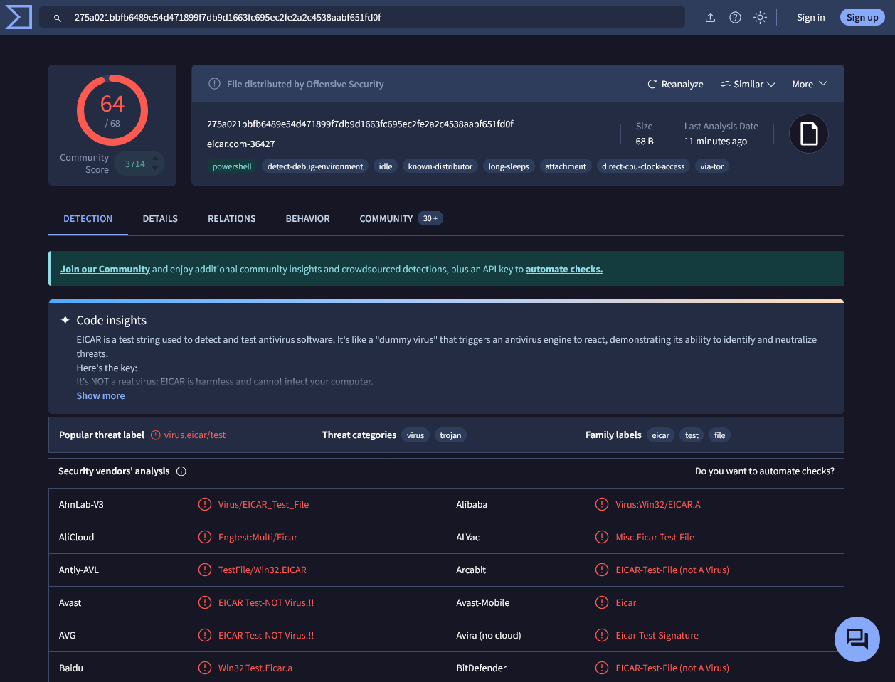

# EICAR Test File Detection

## Overview
This document details a controlled malware detection test using one of EICAR test files to validate my DietPi homelab's ability to monitor through Squid proxy, ClamAV antivirus c-icap and Wazuh SIEM Alerting.

**Date:** January 26, 2026
**Test Objective:** Validate malware detection pipeline from download attempt through SIEM alerting.
**Architecture:** Squid Proxy → ClamAV (c-icap) → Wazuh SIEM  
**Status:** ✅ Pass

---

## Detection flow
1) Firefox (with FoxyProxy extension enabled - see explanation in footnote) attempts to download Eicar file
2) Squid forwards the content to c-icap server on the DietPi server for inspection (sniffing)
3) c-icap decryption passes to ClamAV for malware scanning
4) ClamAV identifies the Eicar test signature and returns 'INFECTED' to Squid
5) Squid blocks the download and presents an error page to the browser
6) Event logged for SIEM analysis

Content was filtered so that the file was intercepted and scanned in transit before reaching the endpoint, therefore reducing the reliance on endpoint/host-based antivirus capabilities.

---

## Incident Timeline

### 1. EICAR Test File Download Attempt
**Source:** https://www.eicar.org/download-anti-malware-testfile/

The EICAR test file was downloaded from the  EICAR website in TXT format.

---

### 2. Real-Time Detection by ClamAV via Squid Proxy
**Detection Time:** Immediate (Proxy-level interception) 
**Detection Method:** Squid Proxy + c-icap + ClamAV Integration 
**Threat Identified:** Eicar-Test-Signature

**Detection Details:**
- **Action:** Download blocked to protect device
- **Threat:** Eicar-Test-Signature
- **URL:** https://secure.eicar.org/eicar.com
- **Protected By:** DietPi Security Lab (clamd-109/27868)
- **Blocking Component:** Squid Proxy with ClamAV integration

---

### 3. ClamAV Log Verification
**Log Location:** /var/log/clamav/clamav.log
**Timestamp:** Mon Jan 26 14:50:39 2026

---

### 4. Wazuh SIEM Alert
**Alert Time:** 2026-01-26T14:50:41.053Z  
**Rule ID:** 52502  
**Severity Level:** 8

---

### 5. Threat Intelligence Verification
**Platform:** VirusTotal  
**File Hash:** 275a021bbfb6489e54d471899f7db9d1663fc695ec2fe2a2c4538aabf651fd0f

**Detection Statistics:**
- **Detection Rate:** 64/68 security vendors
- **Community Score:** 3714
- **File Size:** 68 B
- **Last Analysis:** 11 minutes ago
- **File Type:** eicar.com-36427

**Threat Classification:**
- **Popular Threat Label:** virus.eicar/test
- **Threat Categories:** virus, trojan
- **Family Labels:** eicar, test, file

---

## Detection Performance
- **Time to Detect:** Immediate (0 seconds)
- **Time to Alert:** 2 seconds (detection to SIEM)

### Areas for Improvement
- **SIEM Alert Level** This was a detected and blocked piece of malware, not just a suspicious file detected and therefore the rules should be updated to elevate the level from 8 to 10-12 to better categorise the threat. Especially given my homelab setup, the amounts of alerts can be considered minimal therefore little risk of alert fatigue.

---

## Technical Notes
**Note on SSL Certificate Handling:** This home lab implementation uses FoxyProxy browser extension for self-signed certificate management during proxy SSL interception. Whilst I could install a root ca via Group Policy, due to my home lab not being 'always online' (energy cost), this limitation is by design for testing and ease-of-use purposes only.

---

## Conclusion

This controlled test successfully validated my home lab's network-based malware detection capabilities. The EICAR test file was intercepted by Squid proxy, inspected in real-time via ClamAV integration, blocked before reaching the endpoint, logged and alerted me through the SIEM.

