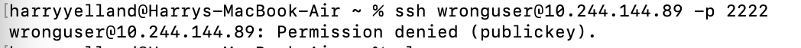
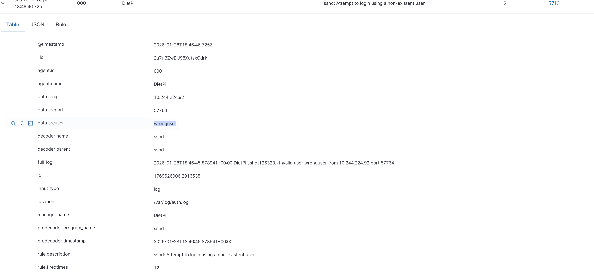

# SSH Invalid Credentials Detection

## Overview
This document details a controlled invalid credentials test using one SSH to validate my DietPi homelab's ability to monitor through syslog and Wazuh SIEM alerting.

**Objective:** Validate invalid credential detection through SIEM alerting.

---

## Detection flow
1) User attempts to connect to the DietPi machine with invalid credentials via SSH
2) Attempt is noted in syslog
3) Wazuh picks up on log and event logged for SIEM analysis

---

## Incident Timeline

### 1. SSH Invalid Credentials Attempt

SSH attempts to connect to the DietPi machine using invalid details.

---

### 2. Wazuh SIEM Alert
**Alert Time:** 2026-01-28T18:46:46.725Z  
**Rule ID:** 5710  
**Severity Level:** 12

---

## Detection Performance
- **Time to Detect:** Immediate (0 seconds)

---

## Conclusion
The SSH Brute Force attack was successfully detected and alerts were created via Wazuh.

---

## Related MITRE Techniques To This Test:

| Technique | ID | Tactic |
|------------|-----|--------|
| Valid Accounts | T1078 | Initial Access / Persistence |
| Brute Force | T1110 | Credential Access |
| Remote Services | T1021 | Lateral Movement |
